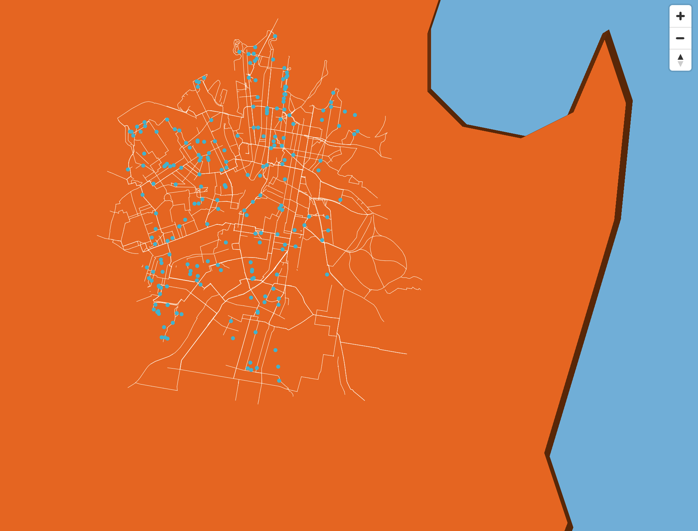

# Serverless Maps

> Servers? Where we're going we don't need servers.

This tutorial will step through a simple process for creating a serverless\* web map using vector tiles.

Our intended audience is folks with:

-   A working knowledge of HTML, CSS, and JavaScript
-   Reasonable experience with mapping and GIS data, techniques, and software
-   Some familiarity with JSON as a format
-   Some familiarity with Python is a bonus, but not required

We'll be using Mapbox GL JS as our mapping software, but both OpenLayers and Leaflet would work equally well.

\* For our purposes "serverless" means "will run on the web server you already have for serving static content"

# 0. Requirements

Before embarking on this journey make sure you've installed the following:

1. Python 3
2. [Tippecanoe: Build vector tilesets from large collections of GeoJSON features](https://github.com/mapbox/tippecanoe)
3. [mbutil: Importer and Exporter of MBTiles](https://github.com/mapbox/mbutil)

Then [download this repository](https://github.com/keithamoss/serverless-maps/archive/master.zip) and unzip it. The `serverless-maps` folder you've just created will be where you're working from for the rest of this tutorial.

# 1. Get some data

We can't have a map without some data can we? We'll be making a map of the cycle network and drinking fountains in Sydney, Australia.

## Natural Earth

-   [1:10m Physical Vectors: Land](https://www.naturalearthdata.com/downloads/10m-physical-vectors/)

## City of Sydney

-   [Drinking fountains](https://data.cityofsydney.nsw.gov.au/datasets/drinking-fountains-water-bubblers?geometry=150.983%2C-33.938%2C151.422%2C-33.839)
-   [Cycle network](https://data.cityofsydney.nsw.gov.au/datasets/cycle-network/data?geometry=150.987%2C-33.939%2C151.426%2C-33.839)

# 2. Convert the data to GeoJSON

Tippecanoe only speaks GeoJSON and CSV, so we'll need to convert our data from its native format (in this case, Shapefiles) to GeoJSON.

You can use QGIS (or your favourite GIS software) to achieve this, but for the purposes of this tutorial we'll use [GDAL's](https://gdal.org) [ogr2ogr](https://gdal.org/programs/ogr2ogr.html) command-line tool.

```
ogr2ogr -f GeoJSON data/natural_earth/ne_10m_land.geojson data/natural_earth/ne_10m_land/ne_10m_land.shp

ogr2ogr -f GeoJSON data/city_of_sydney/Cycle_network.geojson data/city_of_sydney/Cycle_network/Cycle_network.shp

ogr2ogr -f GeoJSON data/city_of_sydney/Drinking_fountains_water_bubblers.geojson data/city_of_sydney/Drinking_fountains_water_bubblers/Drinking_fountains_water_bubblers.shp
```

# 3. Create vector tiles with Tippecanoe

Now that we've got some GeoJSON we can generate our vector tiles with Tippecanoe.

Run these commands to generate your two `.mbtiles` files containing the Natural Earth and City of Sydney data we downloaded earlier.

```
tippecanoe --maximum-zoom=g -o data/natural_earth.mbtiles --drop-densest-as-needed --extend-zooms-if-still-dropping --no-tile-compression data/natural_earth/*.geojson

tippecanoe --maximum-zoom=g -o data/city_of_sydney.mbtiles --drop-densest-as-needed --extend-zooms-if-still-dropping --no-tile-compression data/city_of_sydney/*.geojson
```

`--maximum-zoom=g`: Automatically choose a maxzoom that should be sufficient to clearly distinguish the features and the detail within each feature
`--drop-densest-as-needed`: If the tiles are too big at low zoom levels, drop the least-visible features to allow tiles to be created with those features that remain
`--extend-zooms-if-still-dropping`: If even the tiles at high zoom levels are too big, keep adding zoom levels until one is reached that can represent all the features
`--no-tile-compression`: Don't compress the PBF vector tile data.

**Note:** We're using `--no-tile-compression` because we're assuming the simple web server setup we're using can't set the `Content-Encoding: gzip` header. If that's not the case, feel free to remove this option when you generate your tiles.

Tippecanoe has a [multitude of other options](https://github.com/mapbox/tippecanoe#options) to control exactly how it generates these tiles. They're well worth a look through to familiarise yourself with its more advanced capabilities.

# 4. Unpack the vector tiles

With our `.mbtiles` files made we now need to unpack them into the individual `.pbf` ([Protocolbuffer Binary Format](https://wiki.openstreetmap.org/wiki/PBF_Format)) files for each tile your map will need.

```
mb-util --image_format=pbf data/natural_earth.mbtiles tiles/natural_earth/

mb-util --image_format=pbf data/city_of_sydney.mbtiles tiles/city_of_sydney/
```

This should result in a directory structure that looks something like:

```
tiles/
  city_of_sydney/
    0/
      0/
        0.pbf
    ...
    metadata.json
  natural_earth/
    ...
    metadata.json
```

# 5. Create `tile.json` files

With our tiles created we need to do a bit of processing of the `metadata.json` files that Tippecanoe created.

There's a few things you need to do to translate the `metadata.json` file into the `tile.json` file expected by MapBox GL JS. To save unnecesasary copy/pasting there's a Python script in this repository to handle the translation.

```python
python create-tile-json.py tiles/natural_earth/metadata.json http://0.0.0.0:8000/

python create-tile-json.py tiles/city_of_sydney/metadata.json http://0.0.0.0:8000/
```

## Manual translation

For the curious, there's two steps:

### Add a `tiles` property with the URL to where your tiles will be hosted

```json
"tiles": [
    "http://0.0.0.0:8000/tiles/city_of_sydney/{z}/{x}/{y}.pbf"
],
```

### Add a `vector_layers` property that defines all of your data sources

The `metadata.json` files contain this information in the `json` property, but it is stored as a string (not JSON) and requires some find/replace work to translate it back into JSON.

```json
"vector_layers": [
    {
        "description": "",
        "fields": {
            "featurecla": "String",
            "min_zoom": "Number",
            "scalerank": "Number"
        },
        "id": "ne_10m_land",
        "maxzoom": 5,
        "minzoom": 0
    }
]
```

# 6. Check out your map

Fire up a local development server using Python and head over to [http://0.0.0.0:8000](http://0.0.0.0:8000) to check out your new map.

```
python -m http.server
```

If everything is working you'll see a blank blue map with no data. Hurrah!

# 7. Create your `style.json` file:

So let's add some data. This is a two step process of adding and then styling your data sources.

For the purposes of this tutorial there's a `style-example.json` file you can use that's configured to work with our example data.

If you'd like to build your own `style.json`, take the template file in this directory and make the following changes:

## Add your data sources

```json
"sources": {
    "natural_earth": {
        "type": "vector",
        "url": "./tiles/natural_earth/tile.json"
    },
    "city_of_sydney": {
        "type": "vector",
        "url": "./tiles/city_of_sydney/tile.json"
    }
},
```

## Add and style your layers

Now comes the fun part!

This is a simple style that will:

-   Colour the oceans blue
-   Colour the land orange and extrude it by 300m
-   Display solid white lines for the cycle network
-   Show light blue circles for the drinking fountains

```json
({
    "id": "ne_10m_land",
    "type": "fill-extrusion",
    "source": "natural_earth",
    "source-layer": "ne_10m_land",
    "paint": {
        "fill-extrusion-color": "#cc5500",
        "fill-extrusion-base": 300
    }
},
{
    "id": "Cycle_network",
    "type": "line",
    "source": "city_of_sydney",
    "source-layer": "Cycle_network",
    "layout": {
        "line-cap": "round"
    },
    "paint": {
        "line-color": "#ffffff",
        "line-width": {
            "base": 1.3,
            "stops": [[13, 0.5], [20, 6]]
        }
    }
},
{
    "id": "Drinking_fountains_water_bubblers",
    "type": "circle",
    "source": "city_of_sydney",
    "source-layer": "Drinking_fountains_water_bubblers",
    "paint": {
        "circle-radius": {
            "base": 1.75,
            "stops": [[12, 3], [22, 500]]
        },
        "circle-color": "#3bb2d0"
    }
})
```

This doesn't even begin to scrach the surface of the styling capabilities of Mapbox GL JS. Check out their [examples](https://docs.mapbox.com/mapbox-gl-js/examples/) pages and their [style specification](https://docs.mapbox.com/mapbox-gl-js/style-spec/) for more.

Reload your map again and you should see something like this:



# 8. Publish your map

You're almost done! Now you just need to upload your map somewhere - any regular web host or web server will do the trick.

## Re-run `create-tile-json.py`

Remember to re-run `python create-tile-json.py` from Step 5 to generate new `tile.json` files that include the URL you'll be publishing them to (instead of `http://0.0.0.0:8000/`).

## Mime types

Set the mime type for the `.pbf` tile files to `application/vnd.mapbox-vector-tile` on your web server. This will let your user's web browsers know how to correctly interpret the vector tiles.

## Upload your map

-   `index.html`
-   `style.json`
-   and the contents of the `tiles/` directory

Fire up your web browser and your map should now be published!

# Prior Art

Many thanks and much kudos to Mark Varley for his [Serverless Vector Tiles on AWS](https://github.com/addresscloud/serverless-tiles) tutorial and FOSS4G 2018 Tanzania presentation that gives a much more comprehensive and advanced approach to truly serverless vector tile maps.

Hat tip too to [tilecloud](https://github.com/camptocamp/tilecloud) for a more software developery set of tools.
